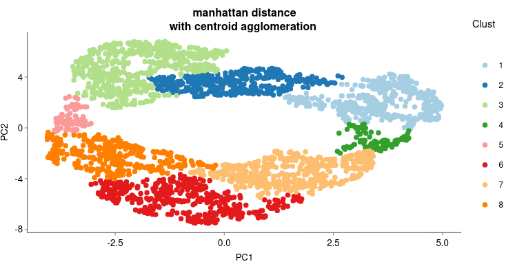

> Authors : 
>
> * Kontxi Martinez, UZH, Zurich, Switzerland
> * Eric Durandau, IMU-CHUV, Lausanne, Switzerland 

Welcome to the web interface of the transcriptomics profiling s of pairs of *Candida albicans* clinical isolates.  This web interface contains results of a trancriptomics analysis aiming at comparing the transcriptomics profile of pairs of *Candida albicans* clinical isolates. 

This work is result from a collaboration between the group of Salome Leibundgut-Landmann [^SalomeGrp] and the group of Dominique Sanglard[^SanglardGRP].

[^SanglardGRP]: Institut de Microbiology Lausanne CHUV https://www.chuv.ch/fr/microbiologie/imu-home/recherche/groupes-de-recherche/dominique-sanglard

# 1. Experimental conditions

> Author: Kontxi Martinez[^Kontxi]

## 1.1 Strains and media

*C. albicans* isolates pairs from different clades (see [table 1.3][#table1.3]) were stored in -80°C in glycerol supplemented medium.  Strains were maintained in YPD
(1% Yeast extract, 2% Peptone, 2% Glucose) agar plates and grown in YPD broth for overnight cultures the day before this experiment.

## 1.2 Seeding C. albicans for RNA-seq (see [fig1](#f1))

The day before experiment, pre-overnights of C. albicans strains to be used are prepared in 5 ml of YPD broth by taking up two-three colonies from a YPD agar plate. These are incubated at 30°C in a shaking incubator for 8 h approximately. Overnights of the strains are set up to a final concentration of an OD600 of 0.1 (1 x 106 cells/ml) in 10 ml of YPD in Erlenmeyer flasks. Flasks are incubated at 30°C in a shaking incubator at 200 rpm.

The day of experiment, C. albicans cells were centrifuged (500 Hl) and washed three times with PBS. The yeast cells were resuspended and diluted in F12 medium to obtain a concentration of 1.5 x 108  cells/ml. In six 96 well plates (two for each time point), relevant wells were filed with 100 pl of fresh F12 medium. A volume of 100 µL of the C. albicans cell dilutions was distributed to each well of the 96 well plate to obtain a concentration of 1.5 x 107 cells/well.

Plates are incubated at 37°C and 5% CO; for the relevant times.
Times:

- Candida cultures are taken out @ 00:00 h.
- Candida cell dilutions are set up @ 00:00 h.
- Seeding of 0 h, 3 h and 6 h time points are set up @ 00:00 h.
- Time point 0h is snap freezed immediately @ 00:00 h.
- Plate of 3h freezed @ 00:00 h.
- Plate of 6h freezed @ 00:00 h.

After X h of infection, plates are spun down at 1500 rpm for 5 min at 4°C. Keep the plate onice. Remove 150 µL of the supernatant, seal plate with parafilm, and snap freeze immediately in liquid nitrogen. Plates are stored at -80°C until lysis and homogenization.

## 1.3 RNA extraction 

Add 96 ml of 100% ethanol to the 24 ml RNA wash buffer concentrate provided by the kit. Reconstitute the DNase | as indicated on the vial prior to use, and store at -20°C.

Take the plates out of -80°C [@ 00:00 h] and add 150 µl of RNA Lysis Buffer to each well. Do not let the plate reach room temperature. Using a tip, scrape the cells off the wells and transfer to an Eppendorf tube containing 600 µl of Lysis Buffer. Mix contents with a tip before transferring the whole 800 µL to the ZR BashingBead Lysis tubes (0.5 mm).

Samples were homogenized six times for 2 minutes at 30 Hz using the TissueLyser Il [@00:00 h]. Every three steps, samples were cooled down on ice for -30 seconds. Even though samples came out of the homogenizer very warm — this is supposed to not be a problem. The tubes were centrifuged for 10 minutes at 10000 rpm at room temperature.

RNA extraction procedure takes place at room temperature.

Supernatants (500 µl approx.) were transferred to Zymo-Spin IIICG Columns placed on collection tubes. These were then centrifuged for 30 seconds. The flow through was mixed With one volume (500 µl) of 96-100% ethanol. Mixture was transferred to a Zymo-Spin IC column in a fresh collection tube and centrifuged for 30 seconds at 10000 rpm. Discard flow through.
 

Add 400 µl of RNA Prep Buffer to the column and centrifuge for 30 seconds at 10000 rpm.
Discard the flow through.

Add 700 µl of RNA Wash Buffer to the column. Centrifuge for 30 sec at 10000 rpm. Discard the flow through.

Add 400 µl of RNA Wash Buffer to the column. Let it stand for a couple of minutes. Centrifuge for 2 min, 10000 rpm. Discard the flow through.

Place the column in a DNase/RNase free 1.5 ml Eppendorf tube. Add 40 ui RNase-free water directly to the membrane without touching it. Close the lid, and let it stand for 2 - 5 minutes at room temperature. Centrifuge at 10000 rpm for 2 min to elute the RNA [@ 00:00h].

Prepare the DNase master mix: Add 0.1 volume (4 Hi} of 10X DNase |! Buffer and 1 pl of rDNase | to the RNA, and mix gently (for 28 samples + 112 li of DNase 1 Buffer and 28 ul of rDNase). Add 5 ul of the master mix to each sample. Incubate samples at 37°C for 30 min [@ 00:00 until 00:00 h].

Resuspend the DNase inactivation reagent by flicking or vortexing. To stop the reaction, add 0.1 volume (4 ul} of DNase inactivation Reagent and mix well. Incubate at least for 2 min, by flicking the tubes 2-3 times during this time [@ 00:00 h]. Centrifuge at 10000 rpm for 2 min. Transfer 35 ul of the supernatant RNA to a fresh tube.

Quantify the amount of RNA using Nano-drop.

*fig1: experimental conditions*

[^Kontxi]: performed by Kontxi Martinez, University of Zurich

# 2. Sequencing

> Author: Eric Durandau

72 samples tubes containing 50µL of RNA extract each as been sent from Zurich To . Prior library preparation the LGTF need to assess the quality of the RNA. RNA extracts are spread into 8-PCR tubes strips and concentration is measured using Nanodrop. For a standard sensitivity assay, sample should not exceed a concentration of 500ng/µL and above 30ng/µL in an optimal volume of 4µL.

RNA have been first quantify using fragment analyser and then sequenced using the TrueSeq illumina technology. Library preparation and sequencing have been performed by the  [GTF](https://wp.unil.ch/gtf/)[^GTF] platform.

[^GTF]: Genomic Technologies Facility, Lausanne, Switzerland https://wp.unil.ch/gtf/

# 4. Read processing, genome alignment and read count

> Author: Eric Durandau

Read processing has been performed using a homemade bioinformatics pipeline called ANAPURNA-seq. A version of the software is available on [GitHUB][1][^1]. ANAPURNAseq (Automated Nextflow Alignment Pipeline for Unprocessed RNA-seq) perform first, various read correction step, then align corrected reads to one or two reference genomes and finally count the number of genes that can be associated with a chosen feature (often *gene* or *CDS*). For a detailed description of ANAPURNA-seq, see the [ANAPURNA-seq](#8.1-anapurna-seq) section in [Appendix](#8.-appendix).

This pipeline has been used to analyse the fastq data from the GREEN and BRAUN pair. Output of the pipeline have been added to the current folder (see the [data](Data)). Readcount tables are then used for normalisation followed by differential gene expression analysis.

# 5. Normalisation of read counts  

> Author: Eric Durandau

## 5.1 Filtering out genes with low read counts

The first step consists in removing features, here genes, with no or low reads in all samples. The sequencing detection limit is estimated at 10. This means that genes with fewer than 10 reads in all samples are considered as not expressed (or expressed under the detection limit) and are thus removed from the analysis. Here, 0 genes have been rejected. The filtering is based on the [filterByExpr](https://rdrr.io/bioc/edgeR/man/filterByExpr.html) from the [edgeR](https://bioconductor.org/packages/release/bioc/vignettes/edgeR/inst/doc/edgeRUsersGuide.pdf) package. The [fig1](#f2) shows the library size after the filtering procedure has been applied.

*fig 2 : Library size of the BRAUN pair run dataset*

## 5.2 TMM based data correction 

This step consists in removing the compositions bias using the TMM (Trimmed means of M-value) [Robinson and Oshlack 2010](8https://genomebiology.biomedcentral.com/articles/10.1186/gb-2010-11-3-r25). In short, samples with different library size cannot be compared with each other. The process consists in normalise the read count such like each sample has artificially the same total number of reads.

The [calcNormFactors](https://www.rdocumentation.org/packages/edgeR/versions/4.16.0/topics/calcNormFactors) from the [edgeR](https://bioconductor.org/packages/release/bioc/vignettes/edgeR/inst/doc/edgeRUsersGuide.pdf) package has been used to perform this process.

The boxplot in [fig 3.](#f3) represents the distribution of genes **log2(cpm)** prior and after correction. **cpm** are *count per milion* of read.

*fig 2 : TMM correction* 

## 5.3 Voom transform of counts : removing heteroscedascity from count data

The basic principle is to remove a bias related to the relationship between gene expression variances and gene expression means. The more condition/replicate we have the better it is. *voom* aim at prepare the data for a further linear fit see chapter 6.2 of [RNA-seq analysis is easy as 1-2-3 with limma, Glimma and edgeR](https://bioconductor.org/packages/release/workflows/vignettes/RNAseq123/inst/doc/limmaWorkflow.html). This operation is performed using the [voom](https://www.rdocumentation.org/packages/limma/versions/4.28.14/topics/voom) function from the [limma](https://www.bioconductor.org/packages/release/bioc/vignettes/limma/inst/doc/usersguide.pdf) package.

For a given data set with multiple samples, it is expected the average read count associated to a gene should not depend on its variance. More simply, the variability among samples should be similar for all the genes and not depends on their average expression level. For RNAseq data, this relationship between variability and expression is unfortunately true (figure right). Lower will be the global number of reads associated to a gene, higher will be the variability among samples. This may have an impact on p-value when comparing the expression of genes between two samples.

Voom transform attempt to correct for this bias. From the comparison of the standard deviation against the average read count of each gene, a model is built (right panel, red line) and used to correct read counts value (left panel). Differential gene expression

## 5.4 Batch effect correction

This step might not be essential since all samples are from the same batch. This can be interesting if sequencing files come from different runs or lanes. The [SVA](https://www.ncbi.nlm.nih.gov/pmc/articles/PMC3307112/) package has been used to infer batch effects. Very quickly sva estimate the number of covariate (surrogate variable) and then adjust value to remove the noise associated with such covariate. Then adjust for the batch effects using Surrogate variables. Here the strategy consists in let the algorithm estimate the potential batch variables rather than feeding it with known sources of batch effect.

Different visualisation can be used to observe the correction of the batch effect. PCA plot is a scatter where each dot is a sample. Ideally, all replicates from a given condition should appear close to each other, indicating a good reproducibility. Our strategy based on the estimation of variables inducing noise may reduce the distance between replicates on the PCA plot (see [fig 3](#f3)).

 *fig 3 : Sample visualisation on a PCA plot*  

# 5. Differential gene expression analysis 

Differential gene expression analysis (DGEA[^DGEA]) consist in the comparison of the number of read counts associated with each genes between two conditions.  Since the dataset is a mix of multiple conditions, the DGEA can be design in different ways depending on whether want to identify genes differencially express between the two isolates, the three time point or the presence or absence of keratinocytes (see [fig1.](#f1)). For example, if the main question is to address whether genes are differentially expressed between the two isolates, the DGEA will be performed by comparing each samples of the Isolate 1 against the sample of the Isolate 2 in the same time and FP/TR conditions. This end up by a matrix of LFC[^18] values where to each line correspond a gene and to each column correspond a single comparison (see [fig 4.](#f4)).   

*Fig 4.: Log2(Fold change) matrix. The analysis focus on the comparison between the CEC3617 (LD[^LD]) and the CEC3605 (HD[^HD]), The BRAUN pair*

R and the [*limma* ][17][^17] package have been used to perform the differential gene expression analysis. In short, once experimental conditions to compare have been set, normalised read count tables are used to fit a linear a model for each gene (basically "averaging" gene expression along replicates). This process is achieved using the *LMfit()* function. Meanwhile, a contrast map defining conditions to compare is built using the *makeContrast()* function. Both the linear model and the contrast map are associated in a new linear model built using the *contrast.fit* function. 

From the last linear model, statistics and log2 fold change (LFC[^18]) values can be extracted using *eBayes()*. Given a linear model fit from *lmFit()*, the function compute moderated t-statistics, moderated F-statistic, and log-odds of differential expression by empirical Bayes moderation of the standard errors towards a global value. Genes differentially expressed are then identified using  *decideTests()* and by applying a filtering based on a pvalue < 0.05% and a LFC > 0.5.   Genes differentially expressed at least 1/3 rd along all comparisons are conserved for the Clustering step.

[^HD]: High Damaging isolate
[^LD]: Low Damaging isolate
[^DGEA]: Differential gene expression analysis

# 6. Gene Clustering

Following the DGEA, selected genes are then clustered depending on their expression pattern. To do so, the LFC matrix from [5.](#5.) is reduced in two dimension using [Uniform Manifold Approximation and Projection](https://joss.theoj.org/papers/10.21105/joss.00861) (UMAP). Mostly used for single cell analysis, the nonlinear dimensionality-reduction technique was developed for the analysis of any type of high-dimensional data. Although principal component analysis (PCA) has historically been the  most commonly used method for dimensionality reduction, the importance  of nonlinear dimensionality reduction techniques has recently been  recognized. Nonlinear dimensionality reduction techniques are, notably,  able to avoid overcrowding of the representation, wherein distinct clusters are represented on an overlapping area.

The LFC matrix from [5.](#5.) isreduced using the *umap()* function of the [M3C](https://bioconductor.org/packages/release/bioc/html/M3C.html)[^M3C] package, resulting to a scatter plot see [fig.5](#f5) where to each dot correspond a gene. They organised in the two dimension depending on their expression pattern. Following the UMAP dimension reduction genes are separated in clusters. First, distance matrix has been first calculated by the *dist()* function using the [manhattan][manhattan][^19] method. Second, hierarchical clustering (*hclust()* function)has been applied on the distance matrix using the "centroid" method. The tree has been cut (*cuttree()* function ) in as many group as the number of cluster to be searched. For BRAUN pair data focusing on the comparison of isolates, 8 clusters have been searched ([fig.5](#f5) ).

*Fig 5. : Result of the UMAP apply on the LFC matrix from  [5.](#5.)*

[^M3C]: https://bioconductor.org/packages/release/bioc/html/M3C.html

# 7. GO enrichment and STRINGdb gene network

Each gene clusters identified in the previous section are then used to determine whether they are associated with known biological functions or whether they are known to be interconnected. [Gene Ontology (GO) enrichment analysis][20][^GO] and [STRINGdb][21][^string] are the two tools used to perform that task.

## 7.1 GO enrichment

Annotated genes are often associated with diverse referenced information. Three onthology classes have been defined by the consortium : Biological process (BP), Cellular Component (CC) and Molecular Function (MF). Each of these classes contains what is called "terms" that define a gene function. Terms can be connected with each other forming a hierarchical tree. Top terms have a very general and are thus associated with a large number of genes. On the opposite, terms at the tails of the tree define very precise gene functions and can be associated with a single gene. The goal of the analysis is to extract terms of each of the three trees for which the list of differentially expressed genes of each cluster is associated with. This list of term then indicate whether a biological function can be associated with a gene set cluster with a particular expression pattern.

GO enrichment analysis has been performed using the R package [ClusterProfiler][CP][^CP]. First, a database containing the whole list of *Candida albicans* annotated genes and their associated GO terms. The database has been built by associating the list of genes referenced in the [NCBI][NCBI][^NCBI] website, the chromosomal feature table of the SC5314 imported from the [Candida genome db][ChrFeatures][^ChrFeatures]website and gene association also imported from the  [Candida genome db][GeneAssociation][^GeneAssociation]. All tables are then used to build the database using the [AnnotationForge][AnnotationForge][^AnnotationForge] package. The *enrichGO()* function from the [ClusterProfiler][CP][^CP] package has been used to find GO terms associated with the gene set of each cluster.

## 7.2 STRINGdb[^string]

The list of genes of each cluster can also be used to query the [STRINGdb][string][^string] database. STRING is a database of known and predicted protein-protein  interactions. The interactions include direct (physical) and indirect  (functional) associations; they stem from computational prediction, from knowledges transfer between organisms, and from interactions aggregated  from other (primary) databases. Interactions in STRING are derived from five main sources (see [fig6](#StringFig) and currently covers 24'584'628 proteins from 5'090 organisms. Each gene set is used to interrogate the STRING network. This result in a network in which nodes are genes from the set connected or not depending on known protein-protein interaction. All of this has been achieved using the R package [STRINGdb][stringR][^stringR]. 

|  Genomic Context Predictions |  High-throughput Lab Experiments |  (Conserved) Co-Expression |  Automated Textmining |  Previous Knowledge in Databases |
| ------------------------------------------------------------ | ------------------------------------------------------------ | ------------------------------------------------------------ | ------------------------------------------------------------ | ------------------------------------------------------------ |
|                                                              |                                                              |                                                              |                                                              |                                                              |

*fig6: source data feeding the STRINGdb database*

# 8. Appendix

## 8.1 ANAPURNA-seq

### 8.1.0 Quick start

ANAPURNA-seq is designed to run on a UNIX-based system and **requires [miniconda][5], [zenity][4], Bash 3.2 (or later) and [Java 8 (or later, up to 15)][6]**. The computer (or sever) running ANAPURNA-seq must also be connected to the internet.

Start ANAPURNA-seq by running the ` $ sh RUN_ANAPURNAseq.sh`. A sequence of windows will appear prompting the user to choose reference genomes.

### 8.1.1 Introduction

ANAPURNAseq (Automated Nextflow Alignment Pipeline for Unprocessed RNA-seq) perform first, various read correction step, then align corrected reads to one or two reference genomes and finally count the number of reads that can be associated to a chosen feature (often *gene* or *CDS*). The result of a run is basically one or multiple "readcount.txt" files (see *[fig A.1](#fA.1)*).	

*fig A.1 : The various steps performed by ANAPURNA-seq* 

ANAPURNA-seq is using various  software from the Bioconda and Conda Forge channels. All softwares are listed in [Table 1.1](#table1.1) with their corresponding function into the pipeline. The first step consists in compressing fastq.gz files by reordering them by similarity. This is achieved using the clumpify function from the [*bbmap*][9][^9] packages. This has the advantage to improve the speed of the downstream steps. Following compression, extremities of reads are trimmed to remove adaptors. 

Multiple steps of filtering are then applied on the compressed reads: Quality filtering, contamination removal, low complexity filtering, removal of artefacts. These are achieved using again the [*bbmap*][9][^9] packages. The last filtering step is the removal of rRNA using the *[sortmerna][10]*[^10] package .

After reads have been compressed, filtered and corrected, they are ready to be aligned to one or two reference genomes. This is achieved by using first the HiSAT [11][12] software  and second the "featurecount" function of the [*subread*][12] [^12]package . The current list of available genomes are shown in [Table 1.2](#table1.2). At the end, of the whole procedure, QC reports and readcount table(s) are generated. QC report enables to check the quality of the reads pre- and post-processing. Readcount tables can then be used for different downstream analysis such as differential gene expression analysis. 

All the steps have been embedded in a *Nextflow* pipeline. Nextflow enables scalable and reproducible scientific workflows using software containers. It allows the adaptation of pipelines written in the most common scripting languages. Nextflow is based on the *data flow* programming model which greatly simplifies writing complex distributed pipelines. Parallelisation is implicitly defined by the processes input and output declarations. The resulting applications are inherently parallel and can scale-up or scale-out, transparently, without having to adapt to a specific platform architecture. This make the language perfectly suited to run on cluster architectures.

### 8.1.2 Procedure to run ANAPURNA-seq 

1. Start ANAPURNA-seq by running the ` $ sh RUN_ANAPURNAseq.sh`
2. Go to the folder where *fastq.gz* have been saved
3. Select the first genome on which reads have to be aligned
4. Select the second genome on which reads, not aligned to the first genome, have to be aligned. Following that step, a terminal window should appear and give you the progress of the processing.
5. When the analysis is done the new message should appear prompting the user to remove or not temporary files. Click OK if you are sure everything has run properly otherwise, re-run ANAPURNA with the same setting.
6. A last window should open indicating in which folder Results can be found

### 8.1.3 Notes

* ANAPURNA-seq can be run stop at any time by selecting the terminal window showing the run progress and by clicking Ctrl+C
* As long as the "work" directory is not deleted from the working directory, all processes already completed are saved. This is useful in case the user wish to run the pipeline multiple times on the same dataset. For example, if the users want to run ANAPURNA a second time and align reads on another genome, none of the steps prior alignment will be performed again. Only the alignment and the featurecount steps. This leads to a large gain of time for the other runs.

# Table

## Table 1.1 : List of packages used by ANAPURNA-seq  

| Name      | Version                    | Function                                                     | Reference     |
| --------- | -------------------------- | ------------------------------------------------------------ | ------------- |
| Nextflow  | 21.05.1.5556               | Parallelisation of processes                                 | [3][3][^3]    |
| Zenity    | 3.32.0                     | GUI                                                          | [4][4][^4]    |
| miniconda | 5.10.1                     | Package management system and environment management system  | [5][5][^5]    |
| Java      | openjdk 11.0.11 2021-04-20 | Development environment for building applications and components | [6][6][^6]    |
| fastqc    | 0.11.9                     | reads QC report                                              | [7][7][^7]    |
| multiqc   | 1.10.1                     | combining multiple QC reports in a single file               | [8][8][^8]    |
| bbmap     | 38.90                      | Removal of adaptors and contamination. Quality, artefacts, and low complexity removal. | [9][9][^9]    |
| sortmerna | 5.3.3                      | Removal of rRNA from various species                         | [10][10][^10] |
| samtools  | 1.12                       | Conversion of files from alignment in *.bam*                 | [13][13][^13] |
| hisat2    | 2.2.1                      | Alignment of reads to a genome                               | [11][11][^11] |
| subread   | 2.0.1                      | Counting the number of reads associated to a feature (*featurecount*) | [12][12][^12] |

## Table 1.2: List of genomes currently available in ANAPURNA-seq 

| Specie                | Strain               |
| --------------------- | -------------------- |
| *Candida albicans*    | SC5314 [14][14][^14] |
| Candida glabrata      | DSY562               |
| Mus musculus          | GRCm38 [15][15][^15] |
| Homo sapiens          | GRCh38 [16][16][^16] |
| Mucor circinelloides  | 1006Phmd             |
| Rhizopus microsporus  | ATCC52813            |
| Candida lusitaniae    | DSY4606_V37          |
| Aspergillus fumigatus | Af_293B              |

# Table 1.3: Clinical isolate pair 

| Pair name | Low damaging isolate | high damaging isolate |
| --------- | -------------------- | --------------------- |
| BRAUN     | CEC3617              | CEC3605               |
| GREEN     | CEC3678              | CEC3621               |
| BLUE      | CEC3609              | CEC3672               |

# References

[1]: https://github.com/Navrique/ANAPURNAseq	"ANAPURNAseq GitHUB"
[2]: ANAPURNA-seq	"ANAPURNA-seq hard copy"
[3]: https://www.nextflow.io/	"nextflow"
[4]: https://doc.ubuntu-fr.org/zenity	"Zenity"
[5]: https://docs.conda.io/en/latest/miniconda.html	"miniconda"
[6]: http://www.oracle.com/technetwork/java/javase/downloads/index.html
[7]: https://www.bioinformatics.babraham.ac.uk/projects/fastqc/	"fastqc"
[8]: https://multiqc.info/	"multiqc"
[9]: https://jgi.doe.gov/data-and-tools/bbtools/bb-tools-user-guide/bbmap-guide/	"bbmap"
[10]: https://github.com/biocore/sortmerna	"sortmerna"
[11]: http://daehwankimlab.github.io/hisat2/	"hisat2"
[12]: http://subread.sourceforge.net/ "subread"
[13]: http://www.htslib.org/	"samtools"
[14]: http://www.candidagenome.org	"Candida genome database"
[15]: https://ftp.ncbi.nlm.nih.gov/genomes/refseq/vertebrate_mammalian/Mus_musculus/latest_assembly_versions/GCF_000001635.27_GRCm39/GCF_000001635.27_GRCm39_genomic.fna.gz	"Mouse reference genome"
[16]: ftp://ftp.ncbi.nlm.nih.gov/refseq/H_sapiens/annotation/GRCh38_latest/refseq_identifiers/GRCh38_latest_genomic.fna.gz	"Human reference genome"
[17]: https://kasperdanielhansen.github.io/genbioconductor/html/limma.html	"limma"

[^1]: https://github.com/Navrique/ANAPURNAseq
[^3]: https://www.nextflow.io/
[^4]: https://doc.ubuntu-fr.org/zenity
[^5]: https://docs.conda.io/en/latest/miniconda.html
[^6]: http://www.oracle.com/technetwork/java/javase/downloads/index.html
[^7]: https://www.bioinformatics.babraham.ac.uk/projects/fastqc/
[^8]: https://multiqc.info/ 
[^9]: https://jgi.doe.gov/data-and-tools/bbtools/bb-tools-user-guide/bbmap-guide/
[^10]: https://github.com/biocore/sortmerna
[^11]: http://daehwankimlab.github.io/hisat2/
[^12]: http://subread.sourceforge.net/
[^13]: http://www.htslib.org/ 
[^14]: http://www.candidagenome.org 
[^15]: https://ftp.ncbi.nlm.nih.gov/genomes/refseq/vertebrate_mammalian/Mus_musculus/latest_assembly_versions/GCF_000001636.27_GRCm39/GCF_000001636.27_GRCm39_genomic.fna.gz
[^16]: ftp://ftp.ncbi.nlm.nih.gov/refseq/H_sapiens/annotation/GRCh38_latest/refseq_identifiers/GRCh38_latest_genomic.fna.gz 
[^17]: https://kasperdanielhansen.github.io/genbioconductor/html/limma.html 
[^18]: log2 fold change
[^19]: https://xlinux.nist.gov/dads/HTML/manhattanDistance.html

[20]: http://geneontology.org/	"GO"

[^GO]: http://geneontology.org/
[^string]: https://string-db.org/

[string]: https://string-db.org/	"STRINGdb"
[CP]: https://guangchuangyu.github.io/software/clusterProfiler/	"ClusterProfiler"

[^CP]: https://guangchuangyu.github.io/software/clusterProfiler/

[AnnotationForge]: https://www.bioconductor.org/packages/release/bioc/vignettes/AnnotationForge/inst/doc/SQLForge.pdf	"Annotation Forge"
[NCBI]: https://www.ncbi.nlm.nih.gov/gene/?term=txid5478Organism:exp	"Gene list NCBI"
[ChrFeatures]: http://www.candidagenome.org/download/chromosomal_feature_files/C_albicans_SC5314/	"Chromosomal features"
[GeneAssociation]: http://www.candidagenome.org/download/go/	"GO association"

[stringR]: https://www.bioconductor.org/packages/release/bioc/html/STRINGdb.html	"STRINGdb package"

[^stringR]: https://www.bioconductor.org/packages/release/bioc/html/STRINGdb.html 
[^GeneAssociation]: http://www.candidagenome.org/download/go/
[^ChrFeatures]: http://www.candidagenome.org/download/chromosomal_feature_files/C_albicans_SC5314/
[^NCBI]: https://www.ncbi.nlm.nih.gov/gene/?term=txid5478
[^AnnotationForge]: https://www.bioconductor.org/packages/release/bioc/vignettes/AnnotationForge/inst/doc/SQLForge.pdf
[^SalomeGrp]: University of  Zurich https://www.vetvir.uzh.ch/en/Research/Immunology.html

[manhattan]: https://xlinux.nist.gov/dads/HTML/manhattanDistance.html	"Manhattan distance"

